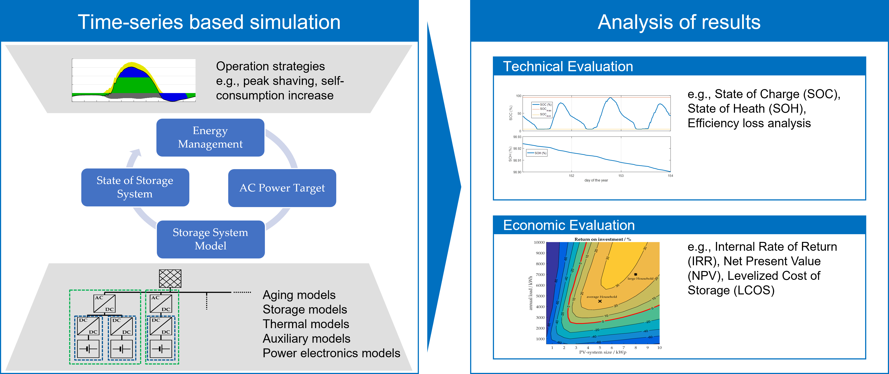

About SimSES
========================================

**SimSES** (Simulation of stationary energy storage systems) is an open source modeling framework for
**simulating stationary and mobile energy storage systems**. The tool, initially developed in MATLAB by Maik Naumann and
Nam Truong, was converted to Python in 2019 and improved by Marc Moeller and Daniel Kucevic at the
Chair of Electrical Energy Storage Technology - Technical University Munich.

SimSES enables a detailed **time-series simulation and evaluation** of stationary and mobile energy storage systems
with the current **main focus on lithium-ion batteries**.
The main component of the **modular and flexible** software-tool is an abstract approach to the
energy storage model, which allows the variation and hybridization of storage technologies and technical sub-components.
Furthermore, stress characterization enables the **estimation of the energy storage degradation**.
Various aging models can be used for this purpose, whereby detailed models based on aging
experiments especially for lithium-ion batteries had been developed at the Chair.
In order to optimize the utilization of the energy storage in **various applications**,
a large number of operating strategies are implemented.
Time series simulations and built-in evaluations allow to calculate and monitor technical parameters for
simulated storage operation. Furthermore, **technical and economic key performance indicators** (characteristics)
are derived and enable the assessment and comparison of the simulation results.

The following figure shows an overview of SimSES. The left part shows the time-series based simulation and the right
part the techno-economic analysis.

.. _simbas_time_series_simulation:

    SimSES Overview of time-series based simulation and techno-economic analysis

.. raw:: html

     
     

This documentation is structured as follows:

    - The :ref:`Quick Start Guide <ref-to-quickstart>` explains the the process of setting up SimSES and the default simulation.
    - An :ref:`Extended Guide <ref-to-extended>` also describes setting up a virtual environment and the usage of your own profiles.
    - The :ref:`Basic Structure of SimSES <ref-to-basic_structure>` deals with the structure of SimSES, the simulation loop and the configuration.
    - Individual :ref:`Examples <ref-to-examples>` of various applications and configurations including Input profiles are explained in the example section.
    - The section :ref:`Usage of SimSES in SimBAS <ref-to-simbas>` describes the possibility of using SimSES within the SimBAS toolchain.
    - The :ref:`FAQs <ref-to-faqs>` provide answers to frequently asked questions about SimSES.
    - The :ref:`Featured Publications <ref-to-publications>` section presents a selection of scientific publications in which SimSES was used.
    - Finally, the :ref:`Contact <ref-to-contact>` section shows ways of getting in touch.
