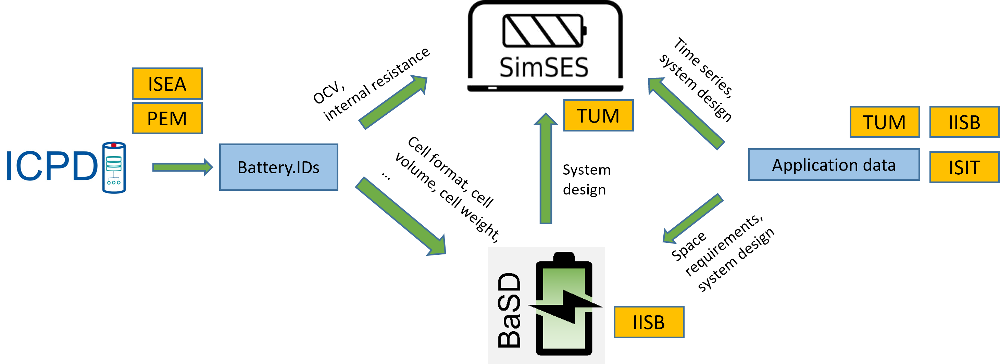

.. _ref-to-simbas:

Usage of SimSES in SimBAS
=========================

.. raw:: html

    SimSES has been used in a number of research projects.
    One of them is the SimBAS (German: <b>Sim</b>ulation von <b>B</b>atteriezellen und <b>A</b>nwendungen in <b>S</b>peichersystemen) project.

1 Overview of SimBAS
-------------------------------------

In SimBAS, an integrated storage simulation toolchain is being developed, encompassing the entire value chain from
battery cell materials to application. This framework within SimBAS enables the mapping of design aspects for both
present and future lithium-ion battery cells to appropriate system designs for various applications, marking the
first instance where technical, economic, and design-specific considerations are collectively addressed.

The following five partners work together within the project:

- Chair of Electrical Energy Storage Technology at TU Munich (EES)
- Chair of Electrochemical Energy Conversion and Storage Systems Technology at RWTH Aachen University (ISEA)
- Production Engineering of E-Mobility Components at RWTH Aachen University (PEM)
- Fraunhofer Institute for Silicon Technology (ISIT)
- Fraunhofer Institute for Integrated Systems and Device Technology (IISB)

The following diagram :ref:`simbas_overview` shows an overview of the tools and interfaces used in SimBAS.

.. raw:: html

    1. The <b>ISEA Cell and Pack Databse (ICPD)</b> developed by ISEA generates <b>Battery.IDs</b> with technical and
    economic information about the battery cell.
    The ICPD uses measured cell data from laboratory tests to draw conclusions about the electrical behavior from
    material parameters.
    More information on the ICPD can be found in the
    <a href="https://basd.readthedocs.io/en" target="_blank">ICPD Documentation</a>.
     
     

    2. Data on the format, weight and dimensions are then transferred to the <b>Battery System Designer (BaSD)</b>
    developed by the IISB.
    BaSD also receives information on system design and architectural requirements, depending on the storage
    application under consideration.
    These are, for example, maximum power and energy requirements or physical restrictions for electric cars.
    BaSD then optimizes the system design for each cell type for the respective application.
    More information about BaSD can be found in the
    <a href="https://basd.readthedocs.io/en" target="_blank">BaSD Documentation</a>.

3. Subsequently, the electrical parameters of the equivalent circuit model and the OCV curve from the Battery.IDs
and the respective optimal system design from BaSD form input data for **SimSES**.
Application data such as the design of the storage system and time series data such as load profiles are also required.
In SimSES, the selected cell is then simulated over time in the application under consideration in order to carry
out efficiency analyses, for example.
The detailed implementation of these simulations is described in the following section.

.. _simbas_overview:

    
    Overview of SimBAS Tools

2 How to use SimSES within the SimBAS toolchain
-------------------------------------------------

2.1 Input data and general structure
~~~~~~~~~~~~~~~~~~~~~~~~~~~~~~~~~~~~

To simulate the different cells in an application in SimSES, the following two input data are required:

1. The digital battery passports of the battery cells (xml-files) that are generated by the ICPD must be stored in the
following folder:

    *.../simses/data/lithium_ion/isea*

If the folder "isea" does not exist, it must be created.

2. The results of BaSD for the optimal system design of the battery cells in the various applications (csv-files)
must be stored in the following folder:

    *.../simses/simulation/simbas*

The latter is also the working folder for the SimSES batch simulations.
The batch simulation makes it possible to run several simulations in parallel.
The number of simulations executed in parallel depends on the number of processor cores and logical processors of your
own computer.
In its initial form, the folder contains the following elements:

    (a) "Profiles" folder, which contains the load profiles of the possible applications.
    (b) *simbas.py*, which is the Python script for running the batch simulations. It contains the SimBAS class,
        which inherits from the batch processing class.
    (c) *room_tool_reader.py*, which is the Python script containg the class *RoomToolReader* for reading the BaSD
        results. One instance of the class is created in *simbas.py*.

2.2 Explanations of *simbas.py*
~~~~~~~~~~~~~~~~~~~~~~~~~~~~~~~~~~~~
The main function of simbas.py first creates an instance of the SimBAS class.
Batch processing is then started using the "run" method.

.. code-block:: python

    if __name__ == "__main__":
        batch_processing: BatchProcessing = SimBAS()
        batch_processing.run()
        batch_processing.clean_up()

The run method of the batch_processing-class then calls the _setup_config method of the SimBAS-class.
This method generates the config files for the individual simulations.

First, the respective use case must be selected at the start of the method.
This describes the battery application that is to be simulated.
Depending on the application, the name of the application-specific config file (*config_file_name*), the name of the
CSV from the BaSD tool (*room_tool_file*) and the AC power of the storage systems (*ac_power*) in Watt are then defined.

.. code-block:: python

        if use_case == 'ecar':
            config_file_name = 'simulation_SimBAS_Ecar'
            room_tool_file = 'report_auto.csv'
            ac_power: float = 93e3
        elif use_case == 'eboat':
            config_file_name = 'simulation_SimBAS_Eboot'
            room_tool_file = 'report_boot.csv'
            ac_power: float = 320000.0
        elif ...

A config is then created, which initially contains the default config values.
The default values are then overwritten by the values of the specific config whose name was saved
as a string in the *config_file_name* variable.
Depending on their preferences, users can adjust the values in the application-specific config file accordingly.

The "Profiles" subfolder is then defined as the folder used for the profile data.
The storage system data in the config is subsequently deleted, as it will be recreated later using the results of the
BaSD tool.

An empty dictionary is now created, which will later contain the individual configs.
The results of the BaSD tool are then read in using the following two lines.
The name of the *room_tool_file* variable is used as the file.

.. code-block:: python

        room_tool_reader: RoomToolReader = RoomToolReader(room_tool_file)
        room_tool_entries = room_tool_reader.get_data_report()

A loop is then run for each entry of the BaSD results, i.e. for each cell for which BaSD has found an
optimized system design.

First, the name of the battery cell is read from the BaSD results and a new copy of the created config is generated
and named *current_config_generator*.
In addition, a name is defined for the current cell type, which is made up of "ISEACellType" and the current cell name.
Then four parameters are read from the BaSD results:

    - the number of serial cells
    - the number of parallel cells
    - the capacity
    - the module voltage.

The parameters are used to add a new storage system to the current config.
To do this, a new lithium-ion battery type with the desired capacity and the defined name is first created.
Then an AC storage system is generated with the AC power defined above, the module voltage, a lossless AC-DC converter
(can be customized) and dummies for housing the storage system and HVAC.
The storage system then consists of the AC storage system, a lossless (can also be customized) DC/DC converter and the
current battery.

Finally, the number of serial and parallel cells is added to the 'BATTERY' section of the config in the loop and the
config is added to the dictionary of the configs.

.. code-block:: python

    for current_number in range(len(room_tool_entries)):

        cell = room_tool_entries["Model"][current_number]
        current_config_generator = copy.deepcopy(config_generator)

        cell_type: str = 'IseaCellType;' + cell + '_00001'
        serial = int(room_tool_entries["Cells in series"][current_number])
        parallel = int(room_tool_entries["Cells in parallel"][current_number])
        energy = int(room_tool_entries["Energy (Wh)"][current_number])
        voltage_ic = int(room_tool_entries["Nom. module voltage (V)"][current_number])

        # Create new storage system
        current_battery = current_config_generator.add_lithium_ion_battery(capacity=energy, cell_type=cell_type)
        ac_system_1: str = current_config_generator.add_storage_system_ac(ac_power, voltage_ic, acdc_1, housing_1,
                                                                      hvac_1)
        current_config_generator.add_storage_system_dc(ac_system_1, dcdc_1, current_battery)

        config: ConfigParser = current_config_generator.get_config()
        # Attention: SimSES can only handle ONE serial/parallel config for ALL batteries
        # config.add_section('BATTERY')
        config.set(BatteryConfig.SECTION, BatteryConfig.CELL_SERIAL_SCALE, str(serial))
        config.set(BatteryConfig.SECTION, BatteryConfig.CELL_PARALLEL_SCALE, str(parallel))

        count += 1
        config_set['storage_' + str(count)] = config

Once the loop has been completed, each cell has its own config in the config_set dictionary.
This dictionary is returned to the batch processing.

The analysis_config method is then called, in which *True* and *False* can be used to set whether the results should be
printed, plotted and analyzed (as batch).
If print is set to True, the SimSES analysis results are written to the command line after the analysis.

.. code-block:: python

    def _analysis_config(self) -> ConfigParser:
        config_generator: AnalysisConfigGenerator = AnalysisConfigGenerator()
        config_generator.print_results(False)
        config_generator.do_plotting(True)
        config_generator.do_batch_analysis(True)
        return config_generator.get_config()

Afterwards the batch processing is started.

The SimSES results are saved in the *.../simses/simulation/simbas/results* folder once the individual simulations
have been completed.
If *do_batch_analysis* was set to True, the SimSES results for every analyzed parameter are saved in individual
CSV-files in the subfolder *.../simses/simulation/simbas/results/batch*.
This means that one parameter can be evaluated for all batch simulations together.

3 Further information about SimBAS
-------------------------------------------------

More information about the project can be found here:

https://www.battnutzung-cluster.de/en/projects/simbas/

https://www.epe.ed.tum.de/en/ees/research-projects/simbas/
